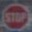

# **Traffic Sign Recognition** 

## Writeup

**Build a Traffic Sign Recognition Project**

The steps of this project are the following:

* Load the data set
* Explore, summarize and visualize the data set
* Design, train and test a model architecture
* Use the model to make predictions on new images
* Analyze the softmax probabilities of the new images
* Summarize the results with a written report

[//]: # (Image References)

[image1]: ./extras/Graph.JPG "Visualization"
[image2]: ./extras/Grid.JPG "Dataset"
[image3]: ./extras/Normalization.JPG "Image Normalization"
[image4]: ./extras/Skew.JPG "Skew1"
[image5]: ./extras/Skew2.JPG "Skew2"
[image6]: ./extras/transformation.png "Image Transformation"

## Rubric Points
###Dataset Exploration

---
### Writeup / README

#### 1. Provide a Writeup / README that includes all the rubric points and how you addressed each one. You can submit your writeup as markdown or pdf. You can use this template as a guide for writing the report. The submission includes the project code.

You're reading it! and here is a link to my [project code](https://github.com/udacity/CarND-Traffic-Sign-Classifier-Project/blob/master/Traffic_Sign_Classifier.ipynb)

### Data Set Summary & Exploration

#### 1. Provide a basic summary of the data set. In the code, the analysis should be done using python, numpy and/or pandas methods rather than hardcoding results manually.

I used the good-old python to calculate summary statistics of the traffic
signs data set:

* The size of training set is 34799 (unaugmented)
* The size of the validation set is 4410
* The size of test set is 12630
* The shape of a traffic sign image is 32x32x3
* The number of unique classes/labels in the data set is 43

#### 2. Include an exploratory visualization of the dataset.

Here is an exploratory visualization of the data set. It is a bar chart showing how the data is not uniformly distributed.

![alt text][image1]

To make the project easier to follow, see the following grid:

![alt_text][image2]

### Design and Test a Model Architecture

#### 1. Describe how you preprocessed the image data. What techniques were chosen and why did you choose these techniques? Consider including images showing the output of each preprocessing technique. Pre-processing refers to techniques such as converting to grayscale, normalization, etc. (OPTIONAL: As described in the "Stand Out Suggestions" part of the rubric, if you generated additional data for training, describe why you decided to generate additional data, how you generated the data, and provide example images of the additional data. Then describe the characteristics of the augmented training set like number of images in the set, number of images for each class, etc.)

It has been suggested that the data needs to be represented as real numbers ranging from (-1, 1), I didn't find that particularly useful in this setting, so I simply used the raw pixel values. My guess is that the bias term takes care of that.

That said, I did some preprocessing on the images. The main thing I noticed is how dim some of the images were, so I normalized all of the images' color intensities. For the training set though, I kept the original (non-normalized) images in addition to the normalized ones, since that would simulate presenting my network with different lighting scenarios.
![alt text][image3]

In order to account for different angles at which the picture of the traffic sign might be taken, I generated a number of randomly skewed images with randomly selected exposures and augmented them to the data set. Here are a couple of examples.

![alt text][image4]

![alt text][image5]

Note: The code for the image transformation logic came from this [source](https://github.com/vxy10/ImageAugmentation).

Now the training set got blown up in size to 765578 (10 randomly skewed images for each normalized and non-normalized image).

######UPDATE (02/05/2018):

It turns out that we don't really need color information all that much. For the most part, the different signs are pretty easy to distinguish given just their shapes, so the Y channel from a YCrCb representation of the images was good enough. Much like earlier though, we need to normalize the brightness of the images. This time around, I tried a technique suggested by a Udacity reviewer (described by [Alex Staravoitau](https://navoshta.com/traffic-signs-classification/)), which is adaptive histogram normalization, as implemented by scikit-image. This was applied to all input images before any further preprocessing. Note that the image transformation described earlier remained as is.

The following example demonstrates an image, the same image with adaptive histogram normalization on the Y channel, and the same image after a random transformation.

![alt text][image6]

#### 2. Describe what your final model architecture looks like including model type, layers, layer sizes, connectivity, etc.) Consider including a diagram and/or table describing the final model.

######UPDATE TO THE MODEL (02/05/2018):

My final model consisted of the following layers:

| Layer         		|     Description	        					| 
|:---------------------:|:---------------------------------------------:| 
| Input         		| 32x32x1 grayscale image   							| 
| Convolution 4x4     	| 1x1 stride, same padding, outputs 32x32x6 |
| Max Pooling 			| 2x2 stride, outputs 16x16x32 |
| Convolution 4x4		| 1x1 stride, same padding, outputs 16x16x32 |
| Convolution 4x4		| 1x1 stride, outputs 16x16x128 |
| Max pooling	      	| 2x2 stride,  outputs 8x8x128 |
| Dropout				| keep_prob = 0.5 |
| Flatten 				| outputs 8192 |
| Fully connected		| outputs 2048 |
| Dropout				| keep_prob = 0.5 |   
| Fully connected		| outputs 768  |
| Dropout				| keep_prob = 0.5 |   
| Fully connected		| outputs 384  |   
| Fully connected		| outputs 43   | 

Note that the activation function used was RELU, and it went between most of the layers above (except the conv 1x1 and the very last fc layer).  

#### 3. Describe how you trained your model. The discussion can include the type of optimizer, the batch size, number of epochs and any hyperparameters such as learning rate.

The networks aims to minimize the cross entropy between the predictions and the labels. With that, I experimented with a number of optimizers, but I ended up sticking with the Adam optimizer. 

I chose a batch size of 256, 10 epochs, and a learning rate of 0.0005.

#### 4. Describe the approach taken for finding a solution and getting the validation set accuracy to be at least 0.93. Include in the discussion the results on the training, validation and test sets and where in the code these were calculated. Your approach may have been an iterative process, in which case, outline the steps you took to get to the final solution and why you chose those steps. Perhaps your solution involved an already well known implementation or architecture. In this case, discuss why you think the architecture is suitable for the current problem.

My final model results were:
* training set accuracy of ?
* validation set accuracy of 96.1% 
* test set accuracy of 93.0%

I started with a LeNet model. I experimented with adding a convolutional layers and fully connected layers with different parameters, changing the activation functions, and introducing dropout at various points in the model.
 

### Test a Model on New Images
######UPDATED (02/05/2018)

#### 1. Choose five German traffic signs found on the web and provide them in the report. For each image, discuss what quality or qualities might be difficult to classify.

Here are five German traffic signs that I found while roaming the streets of Frankfurt on Google maps:

I chose these images to be blurry (I took them from a distance), and some of them, have awkward margins (like the no entry sign), and also distortions from being taken from an awkward angle (see the right-of-way sign) (for which the augmentations mentioned earlier helped quite a lot).

#### 2. Discuss the model's predictions on these new traffic signs and compare the results to predicting on the test set. At a minimum, discuss what the predictions were, the accuracy on these new predictions, and compare the accuracy to the accuracy on the test set (OPTIONAL: Discuss the results in more detail as described in the "Stand Out Suggestions" part of the rubric).

Here are the results of the prediction:

| Image			        |     Prediction	        					| 
|:---------------------:|:---------------------------------------------:| 
| 30 km/h      			| 30 km/h  		| 
| No Entry		     	| No passing	|
| Priority Road			| Priority Road	|
| Right of Way			| Right of way	|
| Stop	      			| Stop			|

The model was able to correctly guess 4 of the 5 traffic signs, which gives an accuracy of 80%, as compared to 92.6% on the test set.

#### 3. Describe how certain the model is when predicting on each of the five new images by looking at the softmax probabilities for each prediction. Provide the top 5 softmax probabilities for each image along with the sign type of each probability. (OPTIONAL: as described in the "Stand Out Suggestions" part of the rubric, visualizations can also be provided such as bar charts)

The code for making predictions on my final model is located in the 11th cell of the Ipython notebook.

The First image was predicted accurately to be a 30 km/h speed-limit sign. The rest of the predictions were for very similar signs, which makes sense.

| Probability         	|     Prediction	        					| 
|:---------------------:|:---------------------------------------------:| 
| 1.00         			| 80 km/h		| 
| 6.11e-08     			| 50 km/h		|
| 2.02e-10     			| 10 km/h		|
| 7.68e-11    			| 80 km/h		|
| 1.83e-12     			| 70 km/h		|

Here is the breakdown for the rest of the images:

No Entry sign (mispredicted):

| Probability         	|     Prediction	        					| 
|:---------------------:|:---------------------------------------------:| 
| 0.43         			| Children Crossing		| 
| 0.40     				| Slippery Road			|
| 0.072					| Beware of Ice/Snow	|
| 0.057	      			| Bicyle Crossing		|
| 0.011	      			| Right of Way at the Next Intersection	|

NOTE: For some odd reason, the predictions were different on the top_k run vs. the argmax run, even though the model hadn't changed in the slightest.

Priority Road sign:

| Probability         	|     Prediction	        					| 
|:---------------------:|:---------------------------------------------:| 
| 1.00         			| Priority Road	|
| 1.23e-08     			| Keep Left		|
| 5.93e-11     			| End of All Speed and Passing Limits	|
| 1.14e-12     			| Roundabout Mandatory					|
| 8.95e-13     			| Go Straight or Left					| 

Stop sign:

| Probability         	|     Prediction	        					| 
|:---------------------:|:---------------------------------------------:| 
| 1.00         			| Stop sign   	|
| 2.22e-16     			| Keep Left   	|
| 5.39e-19     			| Turn Right Ahead	|
| 1.13e-22     			| Keep Right   	|
| 2.96e-24    			| No Entry   	| 

Right-of-way at the next intersection:

| Probability         	|     Prediction	        					| 
|:---------------------:|:---------------------------------------------:| 
| 0.93         			| Right of Way 	|
| 7.95e-03     			| Priority Road	|
| 1.53e-03     			| Roundabout Mandatory 	|
| 9.58e-04     			| Ahead Only   	|
| 1.97e-04     			| Children Crossing   	|  
